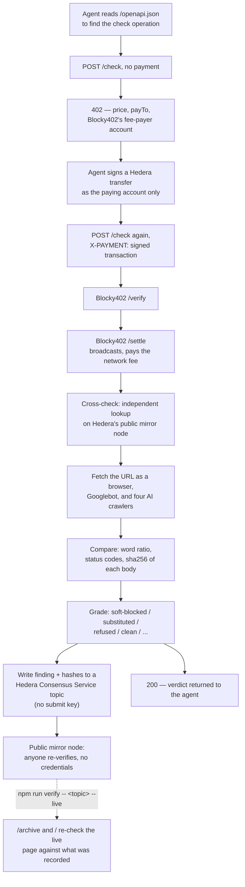

# Botvue

**Some websites answer AI crawlers with `HTTP 200` and an empty page. The agent believes it
read the article, and reports on something it never read.**

Botvue fetches one URL as a browser, as Googlebot, and as each major AI crawler, then
compares what came back.

**Live:** [botvue.onrender.com](https://botvue.onrender.com) — check any URL yourself.
**Full archive:** [botvue.onrender.com/archive](https://botvue.onrender.com/archive) — all
126 properties this scan measured, not just the examples below.

---

## How a check flows through the system



Two things settle independently and are compared, not trusted on their own word: Blocky402's
`/settle` response against the public mirror node for a payment, and the recorded evidence
hash against a fresh fetch for a finding.

---

## The finding

Sixty-four news properties gate AI crawlers through the same vendor, which returns the same
161-byte message every time — *"You are not authorized to access this content without a
valid TollBit Token."*

| Status it is sent with | Responses |
|---|---|
| `402 Payment Required` | **126** |
| `200 OK` | **56** |

Identical bytes. Identical vendor. The status code is a setting.

And in one case the two behaviours sit inside the same company:

| Publisher group | Properties | AI crawlers receive | Status |
|---|---|---|---|
| Hearst **newspapers** | 22 | an empty challenge page | `200` |
| Lee Enterprises | 9–14 | a "not authorized" message | `200` |
| Gannett | 24 | a refusal | `402` |
| Advance Local | 11 | a refusal | `403` |
| Hearst **magazines** | 19 | the article | `200` |
| McClatchy | 15 | the article | `200` |

Googlebot receives the real article on **every** soft-blocking property. Existing cloaking
checkers compare Googlebot against a browser, so all of them come back clean.

Hearst is exact and repeatable. Lee moves between runs for a reason described under
[Limitations](#limitations).

---

## See it in 30 seconds

No accounts, no keys, nothing to sign up for:

```bash
python -m venv .venv && .venv/Scripts/python -m pip install -r requirements.txt
.venv/Scripts/python -m scanner.probe https://www.houstonchronicle.com/
```

```
agent           st       bytes  blocks   new  gone    bps  sha
claudebot       402          —       —     —     —      —
gptbot          200      3,036       1     1     6  10000  32ed63159c77
oai-searchbot   200  1,099,486       6     0     0      0  218a146ccfcf  (identical)
perplexitybot   200      3,036       1     1     6  10000  32ed63159c77
googlebot       200  1,099,486       6     0     0      0  218a146ccfcf  (identical)

>> Googlebot gets the human version while gptbot, perplexitybot do not.
>> Every cloaking checker that compares Googlebot to a browser returns clean here.
```

Your run will show a different hash and byte count on the Googlebot and browser rows — the
homepage changes constantly. `32ed63159c77` on the GPTBot row will be the same as above.

Or run the service and open <http://localhost:8000>:

```bash
.venv/Scripts/python -m uvicorn scanner.gateway:app --port 8000
```

---

## Check any claim here yourself

Every number above is a hash of a response body anyone can fetch again.

```bash
curl -s -H 'User-Agent: Mozilla/5.0 AppleWebKit/537.36 (KHTML, like Gecko); compatible; GPTBot/1.1; +https://openai.com/gptbot)' \
  https://www.houstonchronicle.com/ | sha256sum
```

That still returns, byte for byte, what was recorded on 6 September:

```
32ed63159c77e21ee19ca1b9aa3213ccf0218eb59539560b132a8e68ef0e18ea   3,036 bytes
```

Now run the same command as Googlebot:

```bash
curl -s -H 'User-Agent: Mozilla/5.0 AppleWebKit/537.36 (KHTML, like Gecko); compatible; Googlebot/2.1; +http://www.google.com/bot.html)' \
  https://www.houstonchronicle.com/ | wc -c
```

You will get roughly 1.1 MB, and a **different hash from the recorded one every time** —
because the homepage is alive and its headlines rotate.

That contrast is the point. The page a person gets keeps changing. The page GPTBot gets has
not moved in hours. Transient failures do not hold still; configured responses do.

Two bodies were served **byte-identically across many properties**, which is what makes this
one configuration rather than many coincidences:

| sha256 | Bytes | Served identically on |
|---|---|---|
| `32ed63159c77…` | 3,036 | 23 properties |
| `ad3a87823990…` | 161 | 14 properties |

Both are in [`evidence/stubs/`](evidence/stubs/), verbatim.
[`evidence/manifest.json`](evidence/manifest.json) has all 126 properties with the status,
byte length, word count and hash of every response — browse it filtered by finding at
[botvue.onrender.com/archive](https://botvue.onrender.com/archive), or pull the same data
as JSON from `/evidence/all`.

If a publisher has since changed configuration, the hashes will stop matching. That is why
they are written down.

---

## The record

Findings are anchored to a Hedera consensus topic, because these responses carry
`cache-control: no-store` — nothing is archived, and a configuration can change in an
afternoon.

**Topic [`0.0.10395053`](https://testnet.mirrornode.hedera.com/api/v1/topics/0.0.10395053/messages)**
— open that link. It is Hedera's public mirror node, not us.

```bash
cd packages/chain && npm run verify -- 0.0.10395053 --live
```

`verify` uses no credentials. It reads the public mirror node and re-fetches pages from the
publishers directly, then compares each recorded hash against the site as it is now.

That comparison produced the most useful result in the project:

```
statesman.com  soft-blocked
   live gptbot         unchanged — still serving the recorded body
   live perplexitybot  unchanged — still serving the recorded body
   live googlebot      CHANGED — now 7b3308e38330
```

**The stub is byte-stable; the real page is not.** Hours later the crawler still receives
the identical recorded body while the human page has moved on. Transient failures do not
behave that way. A configured response does.

The topic has **no submit key** — anyone can append to it, including a publisher who
disputes a finding. A record only this project could write to would prove only that this
project wrote something down.

---

## The gateway

An agent asks before it trusts a page.

```bash
curl -X POST localhost:8000/check -H 'content-type: application/json' \
  -d '{"url":"https://www.houstonchronicle.com/"}'
```

```json
{
  "decision": "block",
  "verdict": "soft-blocked",
  "explanation": "This page returned HTTP 200 to AI crawlers with almost none of its content...",
  "word_ratio": {"gptbot": 0.031, "googlebot": 1.0},
  "evidence": {"gptbot": "32ed63159c77…", "googlebot": "<changes between fetches>"}
}
```

**`refused` returns `pass`, not `block`.** A 4xx already tells the agent it got nothing, so
there is nothing to protect it from. Only responses that look like success get a decision.
That distinction is the whole project: this measures deception, not crawler blocking.

The service is x402-gated and settles through the **Blocky402 facilitator** on Hedera
testnet. The caller signs a transfer as the paying account and hands over the frozen,
unsubmitted transaction bytes — Blocky402 names itself as fee payer, adds its own signature,
and broadcasts. The server never holds a private key, and a caller never has to trust the
server's own word that payment settled: Blocky402's `/settle` response is checked a second
time against Hedera's public mirror node, and a disagreement is recorded, not hidden — see
`CrossCheck` in [`scanner/payments.py`](scanner/payments.py).

And it answers `402` when it means "pay me" — which is the thing 56 of those news responses
do not do.

| | |
|---|---|
| Consensus topic | `0.0.10395053` |
| Service payee | `0.0.10395128` |
| Facilitator | Blocky402 (`api.testnet.blocky402.com`) |
| Network | Hedera testnet |

Full flow — discovery, payment, facilitator settlement, independent cross-check:

```bash
cd packages/agent && npx tsx src/run.ts https://www.houstonchronicle.com/ \
  --service https://botvue.onrender.com
```

The agent reads the OpenAPI document to find the endpoint and price, and the 402 body for
the facilitator's fee-payer account. Nothing is hardcoded — a stale copy of any of those
would be a silent-wrong-network failure, which is exactly the failure class this project
spends the rest of its time measuring in other people's services.

The same OpenAPI document is also what a [Bazantic](https://bazantic.com) gateway wraps —
Botvue's own x402 logic stays inside this repo; Bazantic builds an MCP server and a second
payment rail on top of it rather than being handed a pre-built gate.

---

## Limitations

**Detecting *added* content is unreliable, and it does not drive decisions.** Measured
against hand-checked samples, that test is right about **58%** of the time — it mistakes
navigation rails and page metadata for new content. So a `substituted` verdict requires an
explicit promotional marker, an instruction aimed at the reader, or a response header the
browser never receives. Text alone gets `crawler-only-text`, which is reported and never
acted on.

**That costs real findings.** `docs.frends.com` serves crawlers genuine machine-only
instructions, and it is *not* counted, because it carries no marker distinguishing it from
Forbes' navigation rails. Losing recall to keep precision is the deliberate trade: wrongly
blocking a page would end this tool's credibility.

**Soft-block detection needs no classifier**, which is why it leads. It is a ratio of
extracted words. Across 1,483 crawler responses the distribution is bimodal — 6 below 5%,
1,477 above 60%, and **nothing in between** — so there is no threshold to argue about.

**Seven properties flip verdict between runs, and all of them are Lee Enterprises.** The
verdict needs Googlebot to have received the human page, and Lee's homepages rotate enough
that the control drifts across the 0.93 threshold — their control similarities sit at 0.847
to 1.0, right on the boundary. So Lee's soft-block count moves between roughly 9 and 14
depending on the minute you run it.

This does not touch Hearst, whose control sits at 1.0 on every property and does not move.
And it does not affect whether Lee is soft-blocking, only whether this test can say so from
the comparison: Lee's response is a `200` whose body reads *"You are not authorized to
access this content"*, which is self-evident without any control at all.

**Intent is never asserted.** A response can be a policy, a vendor default, or a mistake.
Nothing here distinguishes them, and the harm does not depend on which it is: an agent
receiving `200` cannot tell any of them from success.

**Re-verified 6 September, ~1 hour after the first scan.** The numbers that carry the
argument were byte-identical on both runs: 182 TollBit responses split 126 × `402` and
56 × `200`, and 46 Hearst stub responses. Re-run
`.venv/Scripts/python -m scanner.scan --chains --fresh` to check it yourself.

**Corrections welcome.** If a record is wrong, open an issue and it will be annotated rather
than removed.

---

## How it works

```
scanner/     fetch matrix → normalise → diff → classify → grade
             probe.py     one URL, printed
             scan.py      fetch a corpus        grade.py   verdicts, from cache
             archive.py   freeze evidence       eval.py    measure our own precision
             payments.py  x402 gate, settled through Blocky402, cross-checked on the mirror node
             gateway.py   the FastAPI adapter — transport and payment only, no scan logic
apps/web/    index.html    the public page and URL checker
             archive.html  every property in the frozen scan, filterable and searchable
packages/
  chain/     Hedera consensus attestation, topic creation, mirror-node verify
  agent/     a demo agent that discovers, pays through Blocky402, and verifies
evidence/    frozen observations with hashes, and the stub bodies verbatim
```

Every response is cached to disk, so re-grading the whole corpus costs no requests — which
is what made recovering from a bad run cheap.

Setup, including Hedera credentials: **[SETUP.md](SETUP.md)**

Objections and the evidence that answers them: **[DEFENCE.md](DEFENCE.md)**

## Licence

MIT
